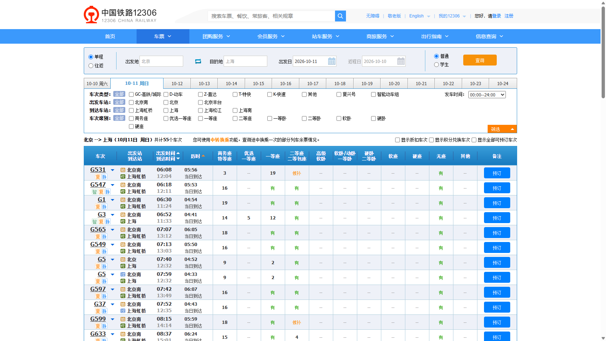

# 票务查询工具：本地安装与验收

## 改进范围

- CLI 对错误参数给出可执行的修正示例；输出选择失败只回读留档，不重放浏览器动作。
- [票务校验器](ticket-results.md)把采集、解析和校验分开，保存字段来源、席别、税费口径及完整时间。
- 浏览器技能与项目协作规范要求任务独占、完整读取适用技能、区分任务标识、按完成通知收集结果。
- 查询结果不是订单承诺：候补、未知库存、禁止预订以及公务舱不混入可购买经济舱最低价。

## 本地安装

在仓库的 `dsb` 目录执行：

```powershell
build build.txt
```

这会先执行 `go test ./...`，通过后 `go install .`。安装位置遵循 `GOBIN` / `GOPATH`；用 `Get-Command dsb` 检查实际命中的程序。

在 `scripts/tickets` 目录执行：

```powershell
build build.txt
```

这会先运行离线 Node 测试，再安装本地私有包；不发布到 npm，不下载票务依赖，不启动 HTTP 服务。PowerShell 可以使用 `dsb-tickets.cmd --help`；其他 shell 使用 `dsb-tickets --help`。

技能以 `.agents/skills` 为源。本次只定向更新浏览器、铁路和网页数据三个技能及其所需参考文件；不强制覆盖无关技能。

## 可见浏览器验收

验收日期：2026-10-10，北京时间。使用独立 Chrome profile 和独立任务，未登录、未下单、未付款。默认托管 profile 已被占用，因此未结束既有 Chrome 进程，改用隔离的测试 profile。

1. 读取官方站码表，校验北京 `BJP`、上海 `SHH`。
2. 以 `Asia/Shanghai` 日历计算明天，得到 `2026-10-11`。
3. 在可见页面填写站点日期，用真实点击查询，等待结果行出现。
4. 运行 `scripts/js/tickets-rail-snapshot.js`，从 DOM 与同源接口读取公开字段，并核对每行公开乘车日期；不导出订单密钥、cookie、token或行 HTML。
5. 将 dsb 完整回执交给 `dsb-tickets`，独立检查日期、站点、时刻、席别、小数票价和统计。

从仓库根目录执行（任务 ID 是示例，必须使用自己拥有的已完成查询任务）：

```powershell
dsb --id 41011 --session ticket-quality-acceptance js '@scripts/js/tickets-rail-snapshot.js' --out tmp/ticket-quality-live.json
dsb-tickets.cmd --input tmp/ticket-quality-live.json --format dsb --date 2026-10-11 --summary --out tmp/ticket-quality-summary.json
```

日期必须替换为本次查询日期。优先使用 `--out` 写 UTF-8，避免 Windows PowerShell 默认重定向编码差异。

### 实际结果

| 检查 | 实际结果 | 判定 |
|---|---|---|
| 官方站码 | BJP / SHH | PASS |
| 实际目标日期 | 2026-10-11 | PASS |
| 乘车方案 / 独立车次 | 55 / 54，同一 G5 可选两个上车站 | PASS |
| 出发站汇总 | 北京南48、北京6、北京丰台1，合计55 | PASS |
| 到达站汇总 | 上海虹桥40、上海11、上海松江3、上海南1，合计55 | PASS |
| 当时可购买的二等座最低价 | D9：340元；未把 D5 候补338元当成可购买最低价 | PASS |
| 故意传入错误日期 | 请求10-12、输入10-11，返回 DATE_MISMATCH 且退出1 | PASS |
| 视口截图 | 下方截图，capture实际模式viewport，无降级 | PASS |

以上为验收时刻快照，不能作为未来日期或当前实时余票承诺。DOM与接口属于同一官方来源的内部一致性核验，不称为两个独立平台验证。



这是一张视口截图，不是整页图。55条方案数量与票价校验来自结构化文本/接口，不从截图推断。

## 最终自动化与安装验证

| 项目 | 结果 |
|---|---|
| 票务离线回归 | 53 项通过，0 失败 |
| Go CLI 全套测试 | `go test ./...` 通过 |
| Go 静态检查 | `go vet ./...` 通过 |
| CLI 定向回归 | 8 项顶层测试通过，覆盖零请求拒绝、UTF-8 BOM、缺文件、本地回读与选择失败 |
| 技能文档与命令表 | 9 项通过，0 失败、0 跳过 |
| 本地 CLI 安装 | `build build.txt` 执行测试及 `go install .` 成功 |
| 本地票务命令安装 | `build build.txt` 执行测试及本地 npm 安装成功 |
| 非项目目录运行 | `dsb-tickets.cmd --help` 及真实快照校验通过 |
| 安装版 CLI 负向验收 | `js --body` 返回退出3及正确写法；缺失 select 返回3，随后本地 last 恢复原始标题 |
| 最终真实快照 | 北京时间14:38:59，55条方案、54个车次，行级日期通过，warnings为空 |

安装前保留了旧 CLI 二进制备份，未修改或重启 Java 后端服务。最终验收另外覆盖“表单新日期、结果行旧日期且时刻/库存相同”的离线负例，返回 DATE_MISMATCH；缺少结果行日期时明确提示 UNVERIFIED_DOM_DATE。

## 验收边界

- 机票数据模型、日期、舱位和税费分组以合成离线数据测试；本轮未重新进行携程/同程全量实时航班查询。
- 校验器是离线工具，不提供新的查询 HTTP API，也不绕过网站验证码。
- 缺失价格、税费或库存保持未知；跨来源价格是否一致需要匹配同一产品、日期、舱位和费用口径，班次数相同不能替代字段校验。
- 本次不修改 Java 服务协议或底层库实现；框架文档仅修正统一响应导入及补充通用时区日期示例。
- Java 文档新增的固定时钟示例已编译运行，UTC晚间转换北京时间后输出预期的下一日历日期。
