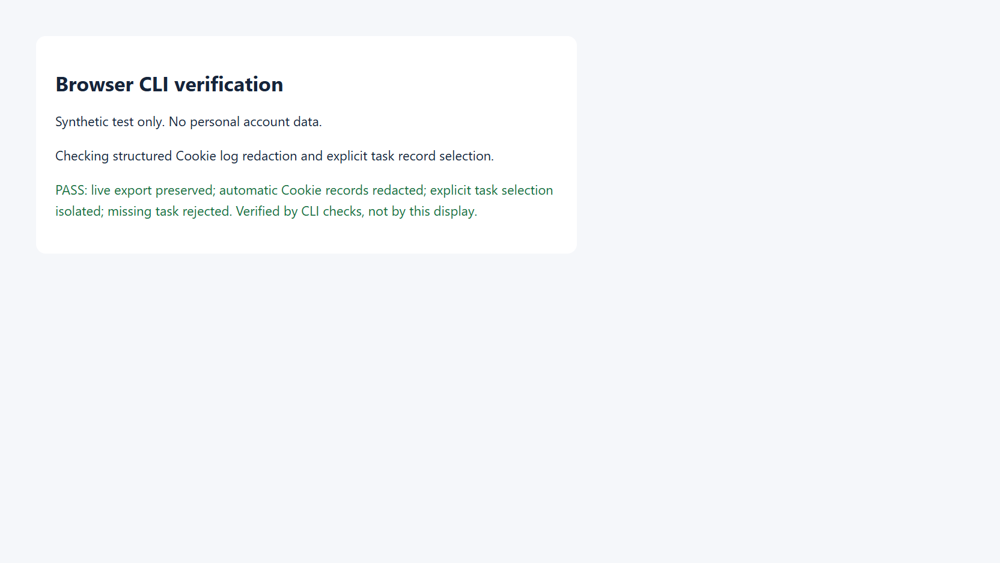

# YouTube 视频下载工作流（Windows）

## 范围与证据边界

本文是应用项目的下载操作记录，不是底层框架文档。仅下载用户有权保存的内容；不绕过会员权限或其他访问限制。下表“已验证”来自既有下载实操。本轮没有重复账号登录或视频下载；另行构建 CLI 并用可见浏览器执行了合成 Cookie 测试，结果见第 8 节。命令中的尖括号内容均为占位符，需替换后逐段执行；安全加固与可复用脚本是**未在本次环境执行验证的建议模板**，不冒充原始逐字命令。

### 已验证事实

| 观察 | 可以得出的结论与限制 |
| --- | --- |
| Windows 普通 Chrome 中人工登录成功；自动化窗口曾被 Google 拒绝 | 两种环境表现不同，但不能将自动化或调试参数归为唯一原因 |
| Chrome 同一 profile 的单实例机制会接管新启动 | 新发启动命令不代表新参数已生效，必须核对实际进程命令行、用户数据目录与 profile |
| 将 `yt-dlp[default]` 安装到全局 Anaconda 后出现 requests 依赖冲突 | 不继续污染全局环境，建议独立 venv；安装仍须用户授权 |
| `--cookies-from-browser` 读出 318 条 cookies 后仍失败 | 数量不证明身份有效，也不证明提取路径足够用于该视频 |
| 同一已登录浏览器中 YouTube 播放可用 | 浏览器侧播放已验证，不等于下载器一定可用 |
| dsb 按 YouTube URL 导出 cookies，转为 Netscape 格式，配合 `--extractor-args youtube:player_client=web` 和显式本机代理后下载成功 | 是组合条件成功，无法单独归因于 cookie 来源或 player client；也不能保证以后必然成功 |
| 最终文件为 360p、H.264、AAC，时长 2508.684 秒，大小 169766681 字节，下载进程正常退出 | 是已完成的 360p 下载，**不是 1080p** |

缺少 SID 不证明未登录。出现二步验证不代表尚未创建 passkey；不能保证使用 passkey 或关闭调试就一定能登录。需要人工认证时交给用户，不收集或记录其账户密码、验证秘密。

## 1. 先锁定目标与授权

1. 明确单条视频 URL、保存目录、期望清晰度与降级规则。用户说“最新”时先明确搜索范围和观察时间。
2. **频道最新**是该频道指定内容范围内按发布时间核实的最新条目；视频、直播、Shorts 是否包含须说明。置顶、首页推荐或列表第一项不自动等于最新。
3. **栏目最新**是指定栏目或播放列表中核实的最新一期，不能拿频道里其他栏目替代。播放列表顺序也未必是发布时间顺序；看标题、栏目归属、发布时间及视频链接后再选。无法穷尽时只报告“已检查范围内最新”。
4. **公开视频**可先尝试不携带登录凭据的格式查询；此分支是建议，非本次成功记录。**会员视频**先在用户有权限的同一登录浏览器确认目标可播放；频道会员权限与普通登录不是同一件事，公开视频成功也不能外推会员内容成功。
5. 如果目标要求 1080p 而格式表只有 360p，先告知并征求降级同意；未经同意不静默降级。

## 2. 环境与 Chrome 交接

建议独立 venv，以下安装命令只能在用户明确授权后执行；缺少 FFmpeg/ffprobe 时另行申请安装，不自行改全局 Anaconda 或系统设置。检查 JavaScript 运行时是否可用：成功实操使用 Deno 解决 JS challenge，`yt-dlp[default]` 不等于已安装外部运行时；缺失时先申请安装。中国大陆环境可在获准后使用可信 Python 包镜像安装，但包镜像不能代替下载视频所需的网络连接。

```powershell
python -m venv .venv-youtube
if ($LASTEXITCODE -ne 0) { throw "创建环境失败" }
$Python = ".\.venv-youtube\Scripts\python.exe"
& $Python -m pip install "yt-dlp[default]"
if ($LASTEXITCODE -ne 0) { throw "安装失败，停止并检查依赖" }
& $Python -m pip check
if ($LASTEXITCODE -ne 0) { throw "依赖检查失败" }
$Ffprobe = "<已安装的ffprobe可执行文件>"
$FfmpegDir = "<已安装的FFmpeg工具目录>"
```

浏览器只由一个任务所有者操作。先确认已登录实例、profile 与任务归属，避免重新启动另一份无登录态的实例。若需改变启动参数，必须核实实际命令行，而不是只看新命令或新窗口；可由用户在本机查看 `chrome://version` 的命令行与 profile 信息，不把其路径截图或原文加入报告。需要关闭时先协调其他任务，由所有者正常关闭自己的任务或浏览器并确认退出；不得全局强杀 Chrome，不得为此关闭其他人的任务、重启共享服务。

以下只使用**已存在、已交接的数字任务 ID**。不要为了导出凭据重复启动浏览器。

## 3. 凭据最小化与临时目录

`get_cookies` 导出相当于交付登录凭据。原始 JSON、Netscape 文件、dsb 请求/响应留档、服务端 trace、宿主工具记录都可能敏感。**不得打印 cookie 正文、粘贴到聊天、提交仓库或上传附件。** 不要用广域 cookie 导出来代替按目标 URL 过滤。

推荐 `--no-record` 避免客户端常规留档，同时设置独立 `--record-dir` 作为隔离边界；它不保证服务端 trace、页面文字、任意 JS、显式 `--out` 或宿主记录被脱敏。执行前核对实际日志策略，必要时由所有者关闭敏感 trace；不能确保凭据不泄漏时暂停导出。任何已有敏感日志副本都要纳入清理，不能只删 Netscape 文件。

**未验证的安全加固模板**：在仓库、同步盘和 Web 静态目录之外创建随机目录；先移除继承权限，仅授权当前用户，再确认 ACL。不要在共享目录中先导出后补权限。

```powershell
$SecretDir = Join-Path $env:TEMP ("youtube-private-" + [guid]::NewGuid().ToString("N"))
New-Item -ItemType Directory -Path $SecretDir -ErrorAction Stop | Out-Null
$Principal = [System.Security.Principal.WindowsIdentity]::GetCurrent().Name
icacls $SecretDir /inheritance:r /grant:r "${Principal}:(OI)(CI)F" | Out-Null
if ($LASTEXITCODE -ne 0) { throw "权限设置失败，不得导出" }
# 在本机核对 ACL；不要把身份和目录信息贴进报告。
Get-Acl -LiteralPath $SecretDir | Out-Null
$Raw = Join-Path $SecretDir "cookies.json"
$Jar = Join-Path $SecretDir "cookies.txt"
$Records = Join-Path $SecretDir "dsb-records"
$TaskId = "<已交接的数字任务ID>"
$Session = "<本次独占会话标签>"
$VideoUrl = "https://www.youtube.com/watch?v=<VIDEO_ID>"
$Proxy = "http://127.0.0.1:<PROXY_PORT>"
$OutputDir = "<用户指定的输出目录>"

dsb --id $TaskId --session $Session --no-auto-start --no-record --record-dir $Records run get_cookies -p "url=$VideoUrl" --out $Raw
if ($LASTEXITCODE -ne 0) { throw "导出失败；只在受保护本地检查，不打印响应正文" }
```

确认代理确实为用户允许的本机代理、端口实际可用，不猜端口、不偷偷切换网络。显式传代理用于保持下载器路径可知，不代表浏览器或其他程序自动走同一路径。

## 4. 转换为 Netscape 格式

以下 PowerShell 模板处理 dsb 完整响应的 `data.cookies`：保留域、路径、secure、过期时间与 HttpOnly 标记；会话 cookie 写 0。只输出错误类别，不输出字段值。该模板是对已验证转换步骤的可复用表达，未在本次任务用真实凭据运行。

```powershell
$Response = [System.IO.File]::ReadAllText($Raw) | ConvertFrom-Json
if ($Response.ok -ne $true -or $null -eq $Response.data.cookies) {
    throw "导出响应结构不符；停止，不猜字段"
}
$Cookies = @($Response.data.cookies)
if ($Cookies.Count -eq 0) { throw "没有可转换的条目" }
$Lines = [System.Collections.Generic.List[string]]::new()
$Lines.Add("# Netscape HTTP Cookie File")
foreach ($Cookie in $Cookies) {
    if ($Cookie.value -eq "[REDACTED]") { throw "这是脱敏留档，不是可用凭据导出" }
    $Domain = [string]$Cookie.domain
    if ($Domain.TrimStart(".") -ne "youtube.com" -and -not $Domain.EndsWith(".youtube.com")) {
        throw "发现非目标域，停止转换"
    }
    $Subdomains = if ($Domain.StartsWith(".")) { "TRUE" } else { "FALSE" }
    if ($Cookie.httpOnly) { $Domain = "#HttpOnly_" + $Domain }
    $Secure = if ($Cookie.secure) { "TRUE" } else { "FALSE" }
    $Expiry = if ([double]$Cookie.expires -gt 0) {
        [long][math]::Floor([double]$Cookie.expires)
    } else { 0 }
    $Fields = @($Domain, $Subdomains, [string]$Cookie.path, $Secure,
        [string]$Expiry, [string]$Cookie.name, [string]$Cookie.value)
    foreach ($Field in $Fields) {
        if ($Field -match "[\t\r\n]") { throw "字段包含不支持的分隔符" }
    }
    $Lines.Add(($Fields -join "`t"))
}
[System.IO.File]::WriteAllLines($Jar, $Lines, [System.Text.UTF8Encoding]::new($false))
Remove-Variable Response, Cookies, Cookie, Fields, Field, Lines -ErrorAction SilentlyContinue
```

不要用 `document.cookie` 替代，它不能覆盖 HttpOnly 项。不要为了缺少 SID 伪造条目，也不要因条目数量多就宣称身份验证成功。

## 5. 先列格式，再选定下载

所有命令在前文变量已设置、凭据保护已确认后执行。显式使用 `--ignore-config` 避免隐式配置干扰；这是可复用建议，非对历史命令逐字复现。

公开视频无凭据查询（建议分支，失败不证明必须有会员）：

```powershell
& $Python -m yt_dlp --ignore-config --no-playlist --proxy $Proxy --list-formats $VideoUrl
if ($LASTEXITCODE -ne 0) { throw "公开格式查询失败，先诊断，不盲目循环" }
```

已验证成功组合的参数模板（先查格式，后下载）：

```powershell
& $Python -m yt_dlp --ignore-config --no-playlist --cookies $Jar --extractor-args "youtube:player_client=web" --proxy $Proxy --list-formats $VideoUrl
if ($LASTEXITCODE -ne 0) { throw "格式查询失败，停止下载" }

# 从刚才列表选一个音画合一ID，或视频ID+音频ID；不要硬编码历史ID。
$Format = "<FORMAT_ID或VIDEO_FORMAT_ID+AUDIO_FORMAT_ID>"
& $Python -m yt_dlp --ignore-config --no-playlist --cookies $Jar --extractor-args "youtube:player_client=web" --proxy $Proxy --ffmpeg-location $FfmpegDir --format $Format --merge-output-format mp4 --output "$OutputDir/%(id)s.%(ext)s" $VideoUrl
$DownloadExit = $LASTEXITCODE
if ($DownloadExit -ne 0) { throw "下载或合并失败，不得报告完成" }
```

从格式表核实清晰度、视频编码、音频及是否需合并，告知用户可用质量后选定 ID。`--merge-output-format mp4` 只约束合并容器，不会自动变成 H.264/AAC，也不会把 360p 提升为 1080p。不要用含宽泛回退的格式表达式隐瞒降级。

失败分支记录，不作为推荐重试路线：

```powershell
# 本次这一类路线提取到318条cookies仍失败，不代表下面占位参数可成功。
& $Python -m yt_dlp --ignore-config --no-playlist --cookies-from-browser "chrome:<PROFILE_LOCATION>" --proxy $Proxy --list-formats $VideoUrl
$BrowserCookieExit = $LASTEXITCODE
# 记录退出码和脱敏错误类别，不展示凭据，不自动重试。
```

若组合路线仍失败，分别记录浏览器可播放与否、导出是否完成、格式查询退出码及脱敏错误类别；不要声称已定位唯一原因。更换 client、passkey、关闭调试、刷新凭据等都只能列作**未验证建议**，需要相应授权后一次改变一个因素核验。

## 6. 后台 job 与完成验收

- 长下载只启动一次，记录宿主返回的真实 job ID。超时转后台不等于失败，不重复下载同一目标。等待通知期间做独立工作；确实被阻塞时才用 `job_output` 的有界等待收集结果，不 busy-poll、不 sleep 循环。
- 返回前收集所有仍相关 job 的最终输出和退出码；不再需要的 job 用 `job_kill` 取消并确认状态。宿主 job ID、dsb 异步 job ID、浏览器任务 ID、子代理 ID 不能混用；dsb 异步任务不交给宿主 `job_output`。
- 退出码正常且产物存在还不够，必须对**最终文件**执行 ffprobe，不对临时分片报成功。

```powershell
$FinalFile = "<下载产生的最终媒体文件>"
& $Ffprobe -v error -show_entries "stream=codec_type,codec_name,width,height:format=duration,size" -of json $FinalFile
if ($LASTEXITCODE -ne 0) { throw "媒体验证失败" }
$Bytes = (Get-Item -LiteralPath $FinalFile -ErrorAction Stop).Length
```

核对视频/音频流、实际高度、编码、时长、文件大小；ffprobe 的 size 与文件字节数应一致。ffprobe 成功不等同于逐帧解码或完整人工观看，不扩大验收口径。历史成功样本：**360p / H.264（h264）/ AAC / 2508.684 秒 / 169766681 字节 / 正常退出**。以后下载不要求复制该数值，而应对照新目标和用户要求验收。

## 7. 清理与回传

先等所有读取凭据的下载 job 结束或已取消，再清理。删除前在本机确认 `$SecretDir` 解析后确为本次生成的临时目录，非仓库、用户目录或共享目录；不要递归删除未核实的计算路径。以下是未验证的清理模板：

```powershell
$ResolvedSecret = (Resolve-Path -LiteralPath $SecretDir -ErrorAction Stop).Path
# 人工在本机核实解析路径及内容，只包含本任务临时数据后，再执行下一条。
Remove-Item -LiteralPath $ResolvedSecret -Recurse -Force -ErrorAction Stop
if (Test-Path -LiteralPath $ResolvedSecret) { throw "临时数据未清理完成" }
Remove-Variable Raw, Jar, SecretDir, ResolvedSecret -ErrorAction SilentlyContinue
```

另行核查 dsb 留档、服务端 trace 和宿主日志中是否存在副本，仅清理本任务所有且允许删除的敏感产物，不删除其他任务日志。不把删除宣称为介质级安全擦除；若已泄露，应告知用户并由用户撤销相关会话。

回传仅包含：目标范围与会员/公开属性、是否降级及授权、最终文件位置、实际清晰度与编码、时长、字节数、退出码、job 已收集情况、凭据清理状态及未完成项。不要附原始 cookies、账户身份或敏感日志。

## 8. 本轮 CLI 改进与验证

此次改动仅位于应用的 Go CLI，不修改 Java 后端或框架库。构建在 CLI 目录执行 `build`，按现有构建配置完成测试与安装。

| 验证项 | 结果 | 证据边界 |
| --- | --- | --- |
| 自动 Cookie 请求/响应留档定向遮蔽 | PASS | 单元测试覆盖单命令、批次、嵌套结果；可见浏览器用保留测试域的合成 Cookie 验证 |
| 显式导出保留原值 | PASS | 仅检查合成值，与 `last` 读到的 `[REDACTED]` 形成对照；未使用个人凭据 |
| 两任务共享会话、显式 ID 筛选 | PASS | 第二任务产生较新记录后，仍能按第一任务 ID 读取其对应记录 |
| 不存在的任务 ID | PASS | 明确报错，没有返回其他任务响应 |
| CLI 构建与回归 | PASS | `go test ./...` 与 `build` 成功 |
| 重跑 YouTube 登录、高清视频下载 | NOT_RUN | 本轮不重复登录、不重下视频；此前 360p 结果不变 |

`last` 按同编号请求的顶层 ID 判断归属。缺失或损坏的请求无法建立归属，不参与筛选；不传显式 ID 时仍读该目录最新响应。保留独占 session 依然有助于减少误读。

截图是**合成测试结果展示页的视口截图**，不是 YouTube 页面，也不是独立的断言来源；判断依据是 CLI 回执和文件内容核验。测试仅关闭本轮创建的页签，没有关闭其他任务。测试域使用的 Cookie 没有账号权限；服务端不支持通过空值写入清除该 Cookie，因此没有为清除测试 Cookie 调用会影响整个共享 profile 的 `clear_cookies`。



### 可复用提示词

> 先确认目标栏目/频道、观察时间、视频 URL、保存目录和允许的清晰度。检查已有工具与用户允许的代理；缺少工具先申请安装，使用独立环境。浏览器任务独占，人工登录期间不操作认证页面。对登录故障只报告观测，不承诺关闭调试即可解决。凭据只在受限本地临时目录中处理，不打印、不入库、不入文档。先列格式，降级先告知。下载只启动一次，收集后台结果后检查最终媒体的时长、分辨率与音视频轨道。对外只给简洁计划、必要进度与有证据的结果；不输出内部推演。操作步骤、验证结论和未验证建议分开记录。
